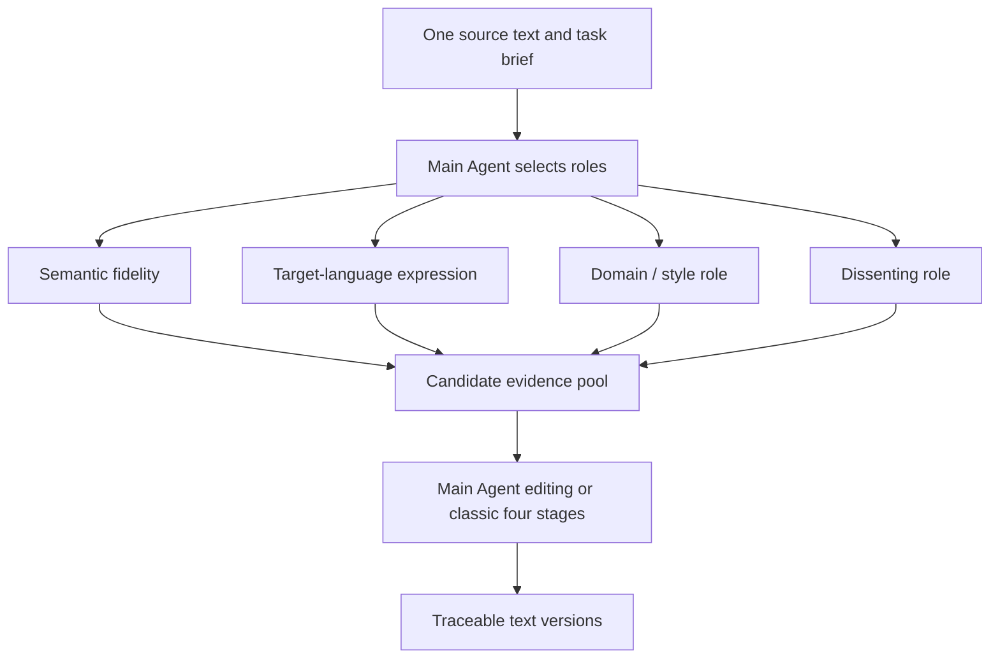

# Agent Architecture

## 1. Multiple Perspectives on the Same Text, Not Task Decomposition

Conventional agents typically split a goal into independent subtasks and handle them separately. This system instead has multiple roles work on the same complete text. Differences in perspective produce comparable candidate translations:



Disagreement between roles is not an error. Runtime failure means an empty response, an empty body, an unauthorized tool call, or failure to meet the minimum candidate threshold. A role can therefore produce a defensible alternative even when it does not become the selected final wording.

Independent role tests calibrate whether a role performs its own mission. They do not search for a universal prompt that replaces multi-agent orchestration. The system's value comes from complementary evidence on the same text and from balanced final selection.

## 2. The 10 × 2 Catalog

The system ships with 10 stable archetypes, each with an English-to-Chinese and a Chinese-to-English variant, for 20 built-in agents in total. `cultural-context` is also the preflight imagery/proper-noun assistant; the other nine archetypes produce complete candidate translations.

| Archetype | Category | Primary responsibility |
|---|---|---|
| semantic-fidelity | foundation | Semantics, syntax, negation, reference, ambiguity |
| target-language-naturalizer | expression | Target-language naturalness and information focus |
| voice-register | expression | Author voice, character identity, register |
| terminology | domain | Terminology, abbreviations, proper nouns, unit consistency |
| cultural-context | domain | Cross-language imagery, proper nouns, allusions, idioms, and cultural context |
| long-context-coherence | foundation | Cross-paragraph reference, time, characters, and argumentation |
| formal-regulated | domain | Obligations, permissions, clauses, and normative strength |
| literary-prose | creative | Imagery, rhythm, narrative perspective, and negative space |
| poetry-form | creative | Line breaks, stanzas, meter, and sound relations |
| dissenting | adversarial | Complete, credible alternative interpretations |

Variant IDs follow `<archetype>.<direction>`, for example `poetry-form.en-to-zh`. Built-in variants are read-only; copying one creates an independent user agent.

## 3. Preflight Assistants

The preflight layer does not expand the catalog to an eleventh candidate agent and does not add a fifth workflow stage:

- The imagery and culture assistant is the `cultural-context` archetype. It runs two parallel analyses with different models before candidate translation, focusing on cross-language imagery, proper nouns, allusions, idioms, and cultural misreadings. It does not produce a candidate translation.
- A poetry-form and rhyme planner is a runtime helper. It runs only when poetry-specific work is enabled and `poetry-form` is selected; it does not consume a built-in catalog slot.
- Ordinary prose does not receive poetry-planning context.
- Poetry planning may describe rhyme positions, rhyme schemes, syntactic continuation, and punctuation boundaries. It must not force one predetermined set of rhyme words.

Lyrics are currently handled as poetic/formal text. The product does not claim melody adaptation, singability, or note-level syllable alignment.

## 4. Runtime Prompt Composition

The complete prompt is assembled only when a role is actually invoked:

```text
Direction-shared base prompt
+ Role module
+ Unmodified task requirements
+ Main Agent's supplemental instruction for this round
+ Full source text
+ FSBP specification
```

The Main Agent's persistent context contains only ten short catalog descriptions. The imagery assistant is marked as already executed and cannot be selected again. Full role prompts are injected on demand, so the initial tool and system context remains compact.

## 5. Dynamic vs. Fixed Teaming

In dynamic mode, the Main Agent can call other roles only through `call_agents`. Each round selects 2–4 roles, with a default session maximum of 5 and at most two rounds. Advanced settings can raise the limit to 10.

Backend invariants:

- At least two successful candidates must exist before the first draft.
- Candidates must come from two different archetypes.
- The Main Agent's own output does not count as a candidate.
- If no valid call is produced, semantic-fidelity and target-language-naturalizer are added as the fallback pair.
- If only one candidate succeeds, a complementary role is added.
- The preset role pool is a hard boundary; the Main Agent cannot call outside it.

In fixed mode, the Main Agent does not select roles. This mode suits batch tasks and reproducible workflows. A fixed preset with fewer than two roles cannot enter an executable state.

## 6. Staged Tools

| Stage | Exposed tools |
|---|---|
| Teaming | `call_agents` |
| First draft and editing | `write_draft`, `replace_text`, `submit_final` |

Tool parameters use structured JSON because they change database state. Candidate and stage content still use FSBP free text.

`write_draft` must cite at least two successful invocations. `replace_text` validates the current base version and unique matching, then creates a Patch and a new version. `submit_final` marks the final version without deleting history.

## 7. Two Drafting Paths

### Main Agent Editing

The Main Agent compares complete candidates, calls `write_draft` to create the first version, refines it through `replace_text`, and calls `submit_final` to submit the final version.

### Classic Four-Stage Pipeline

The stages remain fixed:

```text
Review → Filter → Orchestrate → Assemble
```

Stages cannot be skipped, and no fifth stage is added. Each stage uses the prompt bundle for the current direction. Assemble creates the first version body, which then enters the same evidence-based editor.

Both paths perform the same balance audit before submission:

- Do not decide by candidate majority vote.
- Do not mechanically average different voices into a bland compromise.
- Explain the priorities and costs that fidelity, naturalness, voice, form, culture, and terminology carry for this task.
- Compare keywords and key phrases for part of speech, modifier scope, predicate-object relations, and target-language collocation.
- Preserve ambiguity supported by the source and remove ambiguity introduced only by stiff literal wording.

### Six Independently Bound Execution Roles

Candidate agents retain their own model overrides. The execution chain around them has six separate bindings:

| Role | Responsibility |
|---|---|
| Main Agent | Dynamic team selection, or evidence-based drafting in Main Agent mode |
| Review | Recheck omissions, mistranslations, additions, modifier scope, and constraints against the source |
| Filter | Decide which candidate treatments have enough evidence to continue |
| Orchestrate | Make passage-level choices and audit terminology, grammar, voice, and whole-text coherence |
| Assemble | Produce the formal translation and perform a final source check |
| Editing Agent | Apply conversational edits as traceable patches |

Each binding can select its own endpoint, model, and context window. New sessions and preset revisions freeze all six bindings; later configuration changes cannot alter an active or historical run. Older snapshots fall back to their legacy Main Agent binding in read-only compatibility mode.

Stage events record the endpoint and model resolved at runtime, making it possible to distinguish a binding mistake, a gateway failure, and a model still performing a long reasoning pass.

## 8. Independent Text Testing

The Agent library can test a saved built-in or custom agent on an independent source text. The custom-agent dialog can also run an unsaved role prompt before saving it:

- Enter source text, task requirements, and an optional role-specific instruction.
- Select an explicit endpoint and model, or follow the default translation binding.
- The test creates no session, agent record, or experiment result.
- The UI displays the output as separate FSBP body and annotation.
- A single-agent test checks whether that role fulfills its own mission; it is not a replacement for multi-agent orchestration.

During development, several independent models may compare short prompts with detailed criteria on development samples. Locked test samples must not be used for this tuning.

## 9. Custom Agents

Custom directions can be English-to-Chinese, Chinese-to-English, bidirectional, or a custom language pair. Bidirectional agents must fill in two separate purpose descriptions and prompts; the system does not translate one definition automatically. Modifying or deleting an agent does not affect complete snapshots stored in existing sessions or preset revisions.
