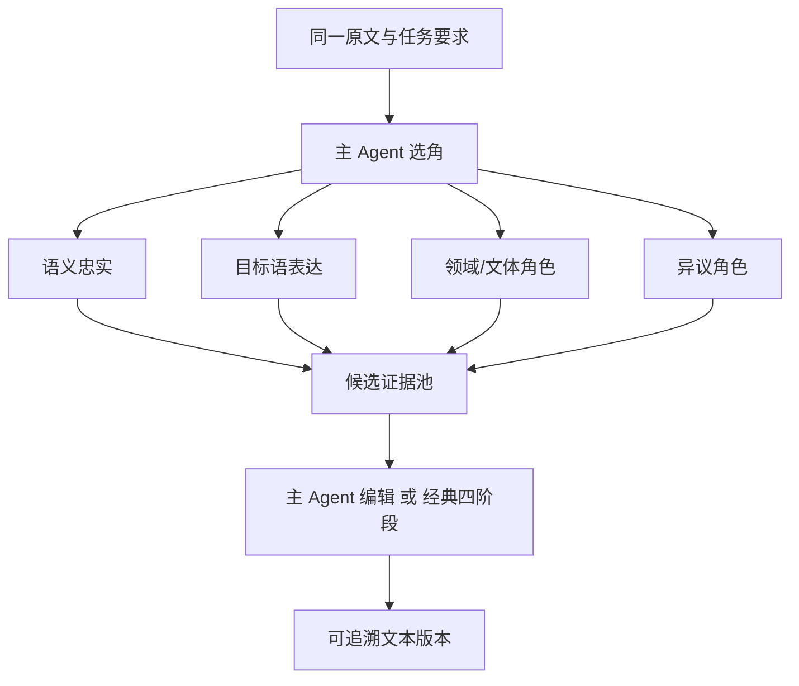

# Agent Architecture

## 1. Multiple Perspectives on the Same Text, Not Task Decomposition

Conventional agents typically split a goal into independent subtasks and handle them separately. This system instead has multiple roles translate the same complete text. The differences in perspective between roles produce comparable candidate translations:



Disagreement between roles is not an error. Only the following situations count as runtime failures: a call returning empty output, unauthorized tool invocation, or failing to meet the minimum candidate threshold.

## 2. The 10 × 2 Catalog

The system ships with 10 stable archetypes, each with two direction variants (English-to-Chinese and Chinese-to-English), for a total of 20 built-in agents.

| Archetype | Category | Primary Responsibility |
|---|---|---|
| semantic-fidelity | foundation | Semantics, syntax, negation, reference, ambiguity |
| target-language-naturalizer | expression | Target language naturalness and information focus |
| voice-register | expression | Author voice, character identity, register |
| terminology | domain | Terminology, abbreviations, proper nouns, unit consistency |
| cultural-context | domain | Allusions, idioms, historical and culturally loaded terms |
| long-context-coherence | foundation | Cross-paragraph reference, time, characters, argumentation |
| formal-regulated | domain | Obligations, permissions, clauses, normative strength |
| literary-prose | creative | Imagery, rhythm, narrative perspective, negative space |
| poetry-form | creative | Line breaks, stanzas, meter, sound relations |
| dissenting | adversarial | Complete, credible alternative interpretations |

Variant IDs follow the format `<archetype>.<direction>`, for example `poetry-form.en-to-zh`. Built-in variants cannot be modified directly. They must be copied to become user-defined agents.

## 3. Runtime Prompt Composition

The full prompt is assembled only when a role is actually invoked:

```text
Direction-shared base prompt
+ Role module
+ Unmodified task requirements
+ Main agent's supplemental instructions for this round
+ Full source text
+ FSBP specification
```

The main agent's persistent context contains only 10 short role descriptions. The full role prompts are not loaded into the initial context, keeping the tool and system prompt sizes manageable.

## 4. Dynamic vs. Fixed Teaming

In dynamic mode, the main agent can only call other roles through the `call_agents` tool. Each round can select 2—4 roles, with a default maximum of 5 across at most 2 rounds. Advanced settings can raise this limit to 10.

Backend invariants:

- At least two successful candidates must exist before the first draft.
- Candidates must come from two different archetypes.
- The main agent's own output does not count as a candidate.
- If no role returns valid output, semantic-fidelity and target-language-naturalizer are automatically added.
- If only one successful candidate exists, a complementary role is automatically added.
- The preset role pool is a hard boundary. The main agent cannot call roles outside it.

In fixed mode, the main agent does not participate in role selection. This mode suits batch tasks and reproducible workflows. A fixed preset with fewer than two roles cannot enter an executable state.

## 5. Phased Tools

| Phase | Exposed Tools |
|---|---|
| Teaming | `call_agents` |
| First draft and editing | `write_draft`, `replace_text`, `submit_final` |

Tool parameters use structured JSON because they modify database state. Candidate content and stage content still use FSBP.

`write_draft` must reference at least two successful invocations. `replace_text` validates the current base version and ensures a unique match before creating a patch and a new version. `submit_final` merely marks the final version; it does not delete history.

## 6. Two Drafting Paths

### Main Agent Editing

The main agent directly compares all complete candidates, calls `write_draft` to create the first draft, refines it via `replace_text`, and finally calls `submit_final` to lock the final version.

### Classic Four-Stage Pipeline

The four stages proceed in a fixed order:

```text
Review → Filter → Orchestrate → Assemble
```

Stages cannot be skipped, and no fifth stage is added. Each stage uses the prompt package for the current direction. The Assemble stage creates the first draft, which then enters the same traceable editor workflow.

### Six Independently Bound Execution Roles

Candidate agents retain their own model overrides. The execution chain around them has six separate bindings:

| Role | Responsibility |
|---|---|
| Main Agent | Dynamic team selection, or evidence-based drafting in Main Agent mode |
| Review | Recheck omissions, mistranslations, additions, modifier scope, and constraints against the source |
| Filter | Decide which candidate treatments have enough evidence to continue |
| Orchestrate | Make passage-level choices and audit terminology, grammar, voice, and whole-text coherence |
| Assemble | Produce the formal translation and perform a final source check |
| Editing Agent | Apply conversational edits as traceable patches |

Each binding can select its own endpoint, model, and context window. New sessions and preset revisions freeze all six bindings, so later configuration changes cannot alter an active or historical run. Older snapshots fall back to their legacy Main Agent binding in read-only compatibility mode.

Stage events record the endpoint and model actually resolved at runtime. This makes it possible to distinguish a binding mistake, a gateway failure, and a model that is still performing a long reasoning pass.

## 7. Custom Agents

Custom directions can be English-to-Chinese, Chinese-to-English, bidirectional, or a custom language pair. Bidirectional agents must fill in two separate purpose descriptions and prompts. The system will not automatically translate role definitions. Modifying or deleting an agent does not affect the complete snapshots of existing sessions or preset revisions.
