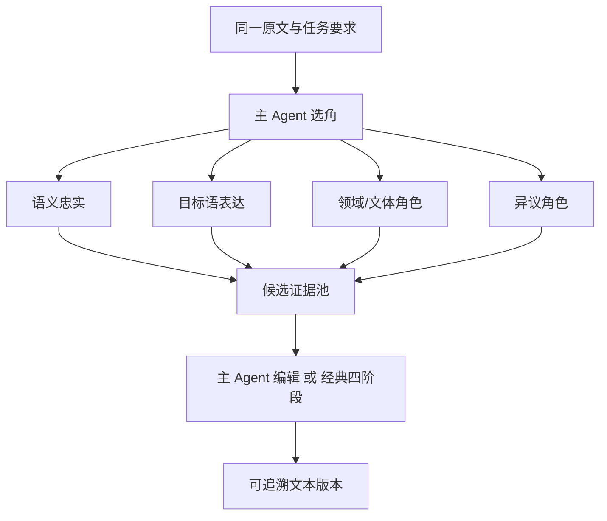

# Agent 架构

## 1. 同题多视角，而非任务分包

通用 Agent 往往把一个目标拆成互相独立的子任务。本系统让多个角色翻译同一份完整文本。角色差异用于产生可比较候选：



分歧不是异常。只有调用失败、正文为空、越权工具调用或不满足最小候选门槛才是运行失败。

## 2. 10 × 2 目录

底层有 10 个稳定原型，每个原型有英译中和中译英两个方向变体，共 20 个内置 Agent。

| 原型 | 分类 | 主要职责 |
|---|---|---|
| semantic-fidelity | foundation | 语义、句法、否定、指代、歧义 |
| target-language-naturalizer | expression | 目标语自然度与信息重心 |
| voice-register | expression | 作者声音、人物身份、语域 |
| terminology | domain | 术语、缩写、专名、单位一致性 |
| cultural-context | domain | 典故、习语、历史与文化负载词 |
| long-context-coherence | foundation | 跨段指代、时间、人物与论证 |
| formal-regulated | domain | 义务、许可、条款、规范强度 |
| literary-prose | creative | 意象、节奏、叙事视角与留白 |
| poetry-form | creative | 分行、分节、韵律、声音关系 |
| dissenting | adversarial | 完整、可信的替代解释 |

稳定变体 ID 使用 `<archetype>.<direction>`，例如 `poetry-form.en-to-zh`。内置变体不可直接修改，复制后成为用户 Agent。

## 3. 运行时提示词组合

真正调用某个角色时才组合完整提示词：

```text
方向公共基础提示词
+ 角色模块
+ 原样任务要求
+ 主 Agent 的本轮补充要求
+ 完整原文
+ FSBP 说明
```

主 Agent 的常驻目录只包含 10 条短说明。完整角色文本不会全部塞入初始上下文，因此工具和系统提示词规模可控。

## 4. 动态与固定组队

动态模式只向主 Agent 暴露 `call_agents`。单轮可选 2—4 个角色，默认总上限 5、最多两轮；高级设置可提高至 10。

后端强制不变量：

- 第一版前至少有两个成功候选；
- 候选来自两个不同原型；
- 主 Agent 自己不算候选；
- 没有有效调用时补入语义忠实与目标语表达；
- 只有一个成功候选时补入互补角色；
- 预设允许池是硬边界，主 Agent 不能越池调用。

固定模式不让主 Agent重新选角，适合批量任务和可复现流程。固定预设少于两个角色时不能进入可执行状态。

## 5. 分阶段工具

| 阶段 | 暴露工具 |
|---|---|
| 组队 | `call_agents` |
| 第一版与编辑 | `write_draft`、`replace_text`、`submit_final` |

工具参数使用结构化 JSON，因为它们改变数据库状态；候选与阶段内容仍使用 FSBP。

`write_draft` 必须引用至少两个成功 invocation。`replace_text` 校验当前基础版本与唯一匹配，成功后建立 Patch 和新版本。`submit_final` 只标记最终版本，不删除历史。

## 6. 双成稿路径

### 主 Agent 编辑

主 Agent直接比较完整候选，调用 `write_draft` 创建第一版，再通过 `replace_text` 精修并 `submit_final`。

### 经典四阶段

顺序固定为：

```text
审查 → 筛选 → 编排 → 组装
```

阶段不可跳过，不增加第五阶段。每阶段使用当前方向提示词包；组装正文创建第一版，然后进入同一证据化编辑器。

## 7. 自定义 Agent

自定义方向可以是英译中、中译英、双向或自定义语言。双向 Agent 必须分别填写两份用途说明和提示词，系统不自动翻译角色定义。修改或删除 Agent 不改变既有会话和 preset revision 的完整快照。
