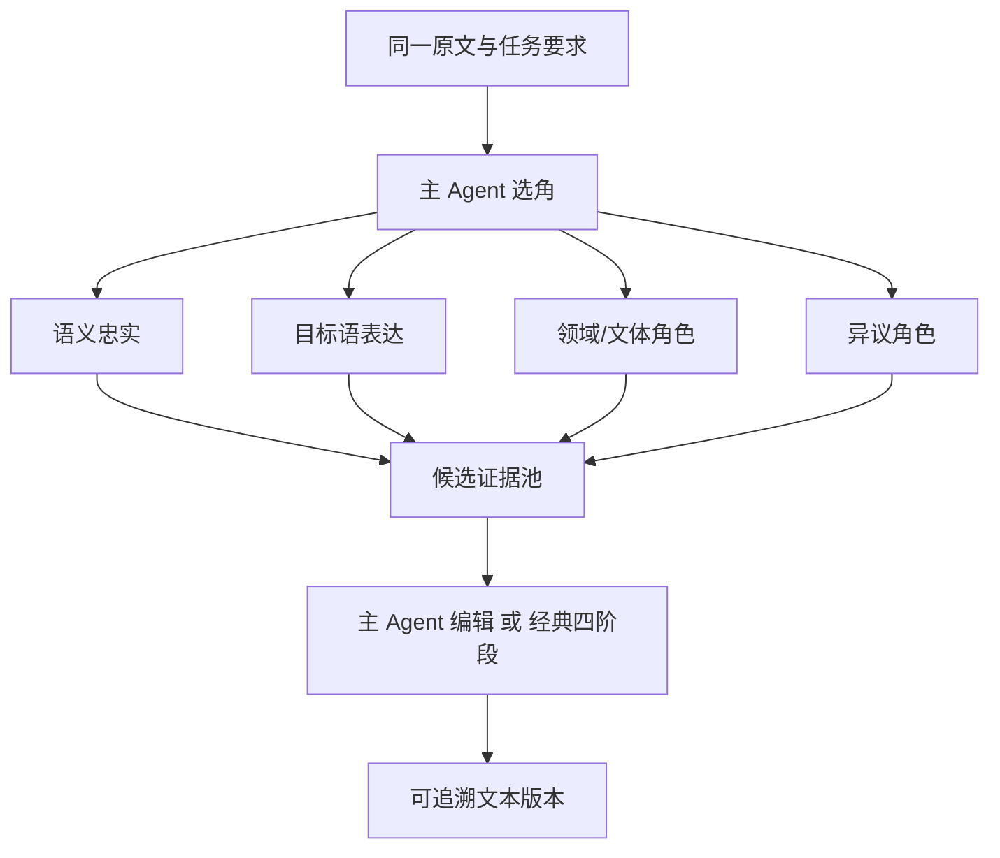

# Agent 架构

## 1. 多角色多视角，而非任务分包

传统的通用 Agent 常把一个大目标拆成多个独立的子任务分别处理。本系统则让多个角色翻译同一份完整文本。不同角色之间的视角差异，用来产出可相互比较的候选译文：



角色之间的分歧不是错误。只有以下情况才算运行失败：调用返回空结果、正文为空、越权调用工具、或者未达到最小候选门槛。

## 2. 10 × 2 角色目录

系统内置 10 个稳定 Agent 原型，每个原型有英译中和中译英两个方向变体，共 20 个内置 Agent。其中 `cultural-context` 在候选翻译前执行分析，其余 9 个原型可以产出完整候选译文。

| 原型 | 分类 | 主要职责 |
|---|---|---|
| semantic-fidelity | foundation | 语义、句法、否定、指代、歧义 |
| target-language-naturalizer | expression | 目标语自然度与信息重心 |
| voice-register | expression | 作者声音、人物身份、语域 |
| terminology | domain | 术语、缩写、专名、单位一致性 |
| cultural-context | domain | 前置分析意象、专有名词、典故、习语与文化误读 |
| long-context-coherence | foundation | 跨段指代、时间、人物与论证 |
| formal-regulated | domain | 义务、许可、条款、规范强度 |
| literary-prose | creative | 意象、节奏、叙事视角与留白 |
| poetry-form | creative | 分行、分节、韵律、声音关系 |
| dissenting | adversarial | 完整、可信的替代解释 |

变体 ID 的格式为 `<archetype>.<direction>`，例如 `poetry-form.en-to-zh`。内置变体不可直接修改，复制后才能成为用户自定义 Agent。

## 3. 按需前置助手

前置机制不把目录扩张成第 11 个候选 Agent，也不增加经典工作流的第五阶段：

- 意象与文化助手是 10 个内置原型之一，始终使用两个不同模型并行分析跨语言意象、专有名词与文化语境，不产出候选译文；
- 诗体与韵律规划助手是按需创建的运行时辅助角色，仅在诗歌专项启用且本次选中 `poetry-form` 时运行，不占用内置目录名额；
- 普通文本不会收到诗歌规划上下文；
- 诗歌规划包含韵位、韵式、句法延续和标点边界，但不会锁死唯一一组韵脚词。

当前歌词只按诗歌文本处理，不声称支持旋律适配、可唱性或音符级音节对齐。

## 4. 运行时提示词组合

只在真正调用某个角色时才组装完整提示词：

```text
方向公共基础提示词
+ 角色模块
+ 原样任务要求
+ 主 Agent 的本轮补充要求
+ 完整原文
+ FSBP 说明
```

主 Agent 的常驻上下文只包含 10 条简短的目录说明，并将意象助手标记为已经执行、不可再次选择。完整角色提示词不会全部塞进初始上下文，因此工具和系统提示词的规模可控。

## 5. 动态组队与固定组队

动态模式下，主 Agent 只能通过 `call_agents` 工具来调用其他角色。每一轮可选择 2—4 个角色，默认最多 5 个、最多两轮；高级设置可提升至 10 个。

后端强制约束：

- 第一版之前至少有两个成功候选；
- 候选必须来自两个不同的原型；
- 主 Agent 自己的输出不算候选；
- 没有任何有效调用时，自动补充语义忠实与目标语表达两个角色；
- 只有一个成功候选时，自动补充互补角色；
- 预设的可用角色池是硬边界，主 Agent 不可越池调用。

固定模式下，主 Agent 不参与选角，适合批量任务和可复现的流程。固定预设如果少于两个角色，则不能进入可执行状态。

## 6. 分阶段工具

| 阶段 | 暴露工具 |
|---|---|
| 组队 | `call_agents` |
| 第一版与编辑 | `write_draft`、`replace_text`、`submit_final` |

工具参数使用结构化 JSON，因为这些参数会改变数据库状态；候选内容和阶段内容仍使用 FSBP。

`write_draft` 必须引用至少两个成功的调用结果。`replace_text` 会校验当前基础版本，确保唯一匹配，匹配成功后创建 Patch 和新版本。`submit_final` 只标记最终版本，不删除历史版本。

## 7. 双成稿路径

### 主 Agent 编辑

主 Agent 直接比较所有完整候选，调用 `write_draft` 创建第一版，然后通过 `replace_text` 精修，最后 `submit_final` 定稿。

### 经典四阶段

四个阶段顺序固定：

```text
审查 → 筛选 → 编排 → 组装
```

阶段不可跳过，也不增加第五阶段。每个阶段使用当前方向的提示词包。组装阶段创建第一版正文，然后进入同一套可追溯的编辑器流程。

## 8. 自定义 Agent

自定义方向可以是英译中、中译英、双向、或自定义语言。双向 Agent 必须分别填写两份用途说明和提示词，系统不会自动翻译角色定义。修改或删除 Agent 不会影响既有会话和 preset revision 的完整快照。
