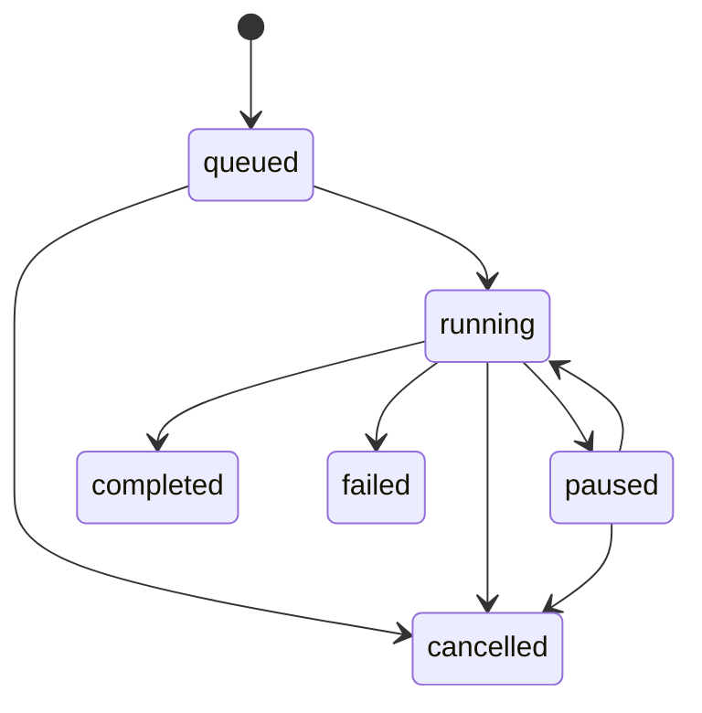

# Presets, Retention, and Batch Queue

## 1. Presets as Work Contracts

The system does not ship with built-in presets that dictate translation strategies. User-defined presets let you reproduce a validated workflow, making them ideal when 100 files need the same role, model, and task template.

`WorkflowPreset` stores the name, description, and current revision. `WorkflowPresetRevision` holds an immutable execution contract. Changing the name or description does not create a new execution revision; any other modification to execution parameters appends a new revision.

Frozen content includes: direction, language, task template, fixed/dynamic formation, review mode, agent snapshot and prompt version, endpoint/model binding, call limits, batch concurrency, and deterministic constraints.

## 2. Loading and Direction

- Loading a preset populates only the current workspace.
- Changes made during a task go into a session snapshot and are not written back to the preset.
- Each preset is bound to a direction; switching in the top bar only filters the view.
- To create a reverse translation direction, use "Copy as New Preset." The system does not translate task requirements automatically.
- If an endpoint or agent is missing, the revision is preserved but execution is blocked, and a full error is displayed.

Legacy user presets are migrated as `en_to_zh` revision 1. Legacy system default presets are not converted to user assets. Old tables are kept read-only.

## 3. Deletion and Swap

Preset deletion is a soft delete: items can be restored from the recycle bin. Historical sessions, batches, and exports continue to reference the frozen revision. Permanent cleanup applies only to metadata that has no references.

JSON import and export do not include API keys. Endpoints are represented only by their stable ID, name, and URL digest. Missing bindings after import must be repaired manually; import itself does not initiate model requests.

## 4. Batch State Machine

A batch must be bound to a specific revision and must save a full snapshot of the contract. Subsequent edits to the preset, switching the direction in the top bar, or closing the browser will not affect that batch.

## 5. File Boundaries

- Supports UTF-8 encoded `.txt` and `.md` files.
- Maximum 500 files per batch, 5 MiB per file.
- Default concurrency is 2, configurable from 1 to 4.
- Invalid UTF-8 encoding, absolute paths, `..` directory traversal, illegal device names, and non-target extensions are rejected.
- Each file creates an independent session.
- A single file failure does not terminate the entire batch. Global errors such as API key or preset issues trigger an automatic pause.
- Pausing only stops dispatching new files; in-flight items continue to completion.
- Cancellation preserves completed results; you can retry only the failed items.
- On restart, the unfinished queue resumes. Any lingering running calls are marked as interrupted.

## 6. Output

Output never overwrites input. The desktop version creates a "preset-name-timestamp" directory under the chosen parent directory. The web version generates a ZIP archive that preserves the same directory structure. Files retain their relative paths, extensions, LF/CRLF line endings, and BOM style, and can include a companion `.audit.json` file. The full audit trail always remains in the application history.
