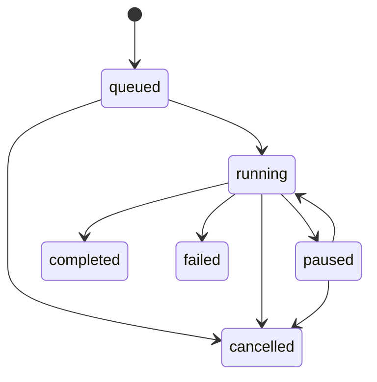

# 预设、留存与批量队列

## 1. 预设是工作契约

系统不内置预设方案，也不会替用户决定翻译策略。用户的预设用于复现经过验证的工作流，特别适合 100 个文件使用相同角色、模型和任务模板的场景。

`WorkflowPreset` 保存名称、说明和当前 revision；`WorkflowPresetRevision` 保存不可变的执行合同。修改名称和描述不会新增执行 revision，其他执行内容的修改一律追加 revision。

锁定内容包括方向、语言、任务模板、固定/动态编队、审议模式、Agent 快照及提示词版本、端点/模型绑定、调用上限、批量并发和确定性约束。

## 2. 加载与方向

- 加载预设时，仅填充当前工作台。
- 本次任务的修改只记录到会话快照，不会回写预设。
- 每个预设绑定一个方向，顶栏切换仅过滤显示。
- 反向翻译方向需通过"复制为新预设"来创建，系统不会自动转换任务要求。
- 缺失端点或 Agent 时保留 revision，但禁止执行并展示完整错误。

旧版用户预设迁移为 `en_to_zh` revision 1；旧版系统默认预设不转为用户资产。旧表保持只读。

## 3. 删除与交换

预设采用软删除，回收站中可恢复。历史会话、批次和导出继续引用冻结的 revision。永久清理仅适用于没有任何引用的元数据。

JSON 导入导出不包含 API Key。端点仅用稳定 ID、名称和 URL 摘要表示；导入后缺失的绑定需手动修复，导入本身不会发起模型请求。

## 4. 批量状态机

批次必须绑定一个确定的 revision，并保存完整的合同快照。后续编辑预设、切换顶栏方向或关闭浏览器都不会改变该批次。

## 5. 文件边界

- 支持 UTF-8 编码的 `.txt` 和 `.md` 文件。
- 每批最多 500 个文件，单个文件最大 5 MiB。
- 默认并发数为 2，可设为 1 到 4。
- 拒绝无效 UTF-8 编码、绝对路径、`..` 目录穿越、非法设备名以及非目标扩展名。
- 每个文件创建独立的会话。
- 单个文件失败不会终止整个批次；API Key 或预设等全局性错误会自动暂停。
- 暂停仅停止派发新文件，正在运行的项目继续完成。
- 取消保留已完成的结果，可仅重试失败项。
- 启动时恢复未完成的队列，残留的 running 调用标记为 interrupted。

## 6. 输出

输出永不覆盖输入。桌面版在选定父目录后创建"预设名-时间戳"目录；Web 版生成保持同一树形结构的 ZIP。文件保留相对路径、扩展名、LF/CRLF 及 BOM 风格，并可附带 `.audit.json`。完整审计记录始终保留在应用历史中。
