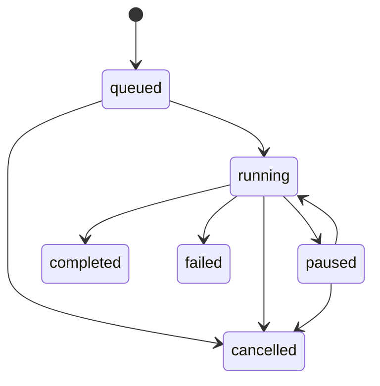

# 预设、留存与批量队列

## 1. 预设是工作契约

系统不提供替用户决定翻译策略的内置预设。用户预设用于复现一个已经认可的工作流，尤其适合 100 个文件使用相同角色、模型和任务模板的场景。

`WorkflowPreset` 保存名称、说明和当前 revision；`WorkflowPresetRevision` 保存不可变执行合同。改名和改说明不新建执行 revision，其他执行内容的修改一律追加 revision。

冻结内容包括方向、语言、任务模板、固定/动态编队、审议模式、Agent 快照及提示词版本、端点/模型绑定、调用上限、批量并发和确定性约束。

## 2. 加载与方向

- 加载预设只填充当前工作台；
- 本次任务修改只进入会话快照，不反写预设；
- 预设绑定一个方向，顶栏切换只过滤；
- 反向版本通过“复制为新预设”建立，系统不翻译任务要求；
- 缺失端点或 Agent 时保留 revision，但禁止执行并展示完整错误。

旧用户预设迁移为 `en_to_zh` revision 1；旧系统默认预设不转成用户资产。旧表只读保留。

## 3. 删除与交换

预设删除为软删除，回收站可恢复。历史会话、批次和导出继续引用冻结 revision。永久清理只适用于没有任何引用的元数据。

JSON 导入导出不包含 API Key。端点只用稳定 ID、名称和 URL 摘要表示；导入后缺失绑定必须手动修复，导入本身不发起模型请求。

## 4. 批量状态机

批次必须绑定一个确定 revision，并保存完整合同快照。后续编辑预设、切换顶栏方向或关闭浏览器都不会改变该批次。

## 5. 文件边界

- 支持 UTF-8 `.txt` 与 `.md`；
- 每批最多 500 个文件，单文件最多 5 MiB；
- 默认并发 2，可设 1—4；
- 拒绝无效 UTF-8、绝对路径、`..`、非法设备名和非目标扩展名；
- 每个文件创建独立会话；
- 普通单项失败不终止全批，API Key/预设等全局错误自动暂停；
- 暂停只停止派发新文件，运行中项目继续完成；
- 取消保留已完成结果，可仅重试失败项；
- 启动恢复未完成队列，遗留 running 调用标记 interrupted。

## 6. 输出

输出永不覆盖输入。桌面版选择父目录后建立“预设名-时间戳”目录；Web 版生成同一树形结构的 ZIP。文件保留相对路径、扩展名、LF/CRLF 与 BOM 风格，并可附带 `.audit.json`。完整审计始终留在应用历史中。
