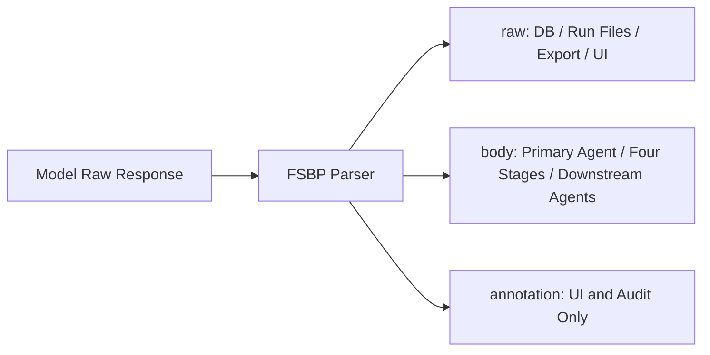

# Free-text Semantic Boundary Protocol (FSBP v2)

## 1. Motivation

Tasks like translation, review, and literary judgment don't have a fixed set of fields. Forcing a model to squeeze its reasoning into a fixed JSON schema conflates two very different success conditions: "does the content make sense" and "does the string comply with the schema." FSBP separates them:

- The Agent's content layer remains free text.
- System state changes still use tool parameters with a schema.
- A single minimal delimiter prevents annotations from anchoring subsequent review.

FSBP is not a general-purpose text parser, nor is it a degraded fallback for JSON. It is a production-grade formal Agent content protocol.

## 2. Protocol Composition

FSBP consists of seven mutually reinforcing standards:

1. **Free semantic generation**: an Agent completes an open task in natural language instead of squeezing content into fixed fields for a parser.
2. **Body and explanation separation**: content before the boundary is an inheritable result; content after it is an explanation, trade-off, or note.
3. **Selective inheritance**: downstream stages receive only the body, reducing the chance that upstream self-defense anchors review.
4. **Complete evidence retention**: raw output, body, annotation, model, prompt version, call relationships, and errors remain available for audit.
5. **Independent multi-perspective deliberation**: several roles generate candidates for the same open problem; disagreement is comparison material, not a schema exception.
6. **Separate content and state protocols**: translation, review, and opinions use semantic free text, while Agent calls, version edits, and submission use validated structured tool parameters.
7. **Explicit failure instead of silent trimming**: body content must not be silently truncated, rewritten, or discarded for formatting, context, or parsing convenience.

The core invariant is therefore: expression remains free, while inheritance, archival, and state-changing operations are explicit.

## 3. Data Structures

```ts
interface SemanticAgentOutput {
  raw: string
  body: string
  annotation: string | null
}
```

- `raw`: The complete original text returned by the model, preserved verbatim.
- `body`: The text before the final valid boundary, passed to downstream consumers.
- `annotation`: The text after the boundary, visible only to users, audits, and experimental analysis.

## 4. Syntax

A boundary is a standalone line that, after trimming leading and trailing whitespace, equals exactly three ASCII hyphens:

```text
---
```

Parsing algorithm:

1. Normalize CRLF and bare CR to LF. This normalization is used only for parsing; it does not rewrite `raw`.
2. Scan backward to find the final position where `line.trim() === '---'`.
3. If not found, the entire normalized text is treated as `body`, and `annotation = null`.
4. If found, the content before it becomes `body`, and all content after it becomes `annotation`.
5. Any earlier standalone `---` remains part of the body and carries no boundary meaning.
6. The body may be empty, but an empty body does not count as a valid candidate and cannot satisfy the evidence threshold for `write_draft`.

The following are not boundaries:

```text
inline --- dashes
----
`---`
```

## 5. Data Flow and Invariants



The system must maintain the following rules:

1. The database, run logs, and exports must preserve the full `raw`.
2. Candidate Agents, the four-stage pipeline, and editing contexts inherit only the upstream `body`.
3. The UI may display both body and annotation, but must not present annotation as body.
4. The body must not be silently truncated due to token budget limits. If a context cap is configured, the system must fail explicitly before invocation.
5. Parsing failures must not alter the original text. The protocol parser itself must not invoke a model to "fix the format."
6. JSON in tool calls, API JSON, configuration JSON, and SSE JSON are not subject to this protocol.

## 6. Deliberation Standards

FSBP does not prescribe one translation theory, but every stage follows these process standards:

- Candidates must be complete, independently readable results rather than suggestions only.
- A role limits the angle of observation, not a fixed set of output fields.
- Downstream review starts from the source, task requirements, and candidate bodies.
- A confident tone or longer explanation does not automatically receive more weight.
- Review checks semantic structure, logic, voice, and domain concepts before target-language polish.
- Unresolved questions are marked for verification; format success cannot substitute for content correctness.

These standards and the `---` parsing rule together define FSBP. Changing the number of roles does not require a protocol-version change; changing inheritance, archival, or boundary semantics does.

## 7. Four Stages

Each stage (review, filter, orchestrate, assemble) saves `raw / body / annotation` under the same rules. The input to stage N consists of the full source text, the task requirements, the `body` of all successful candidates, and the `body` from stages 1 through N-1. The `body` from the assemble stage forms the first version of the text; annotations do not enter the version body.

Free text does not allow a stage to arbitrarily change what its body means. To make body-only inheritance preserve the evidence required downstream, the four stages use a stable semantic contract:

- `review.body` contains prioritized errors, risks, and useful treatments for direct use by filtering;
- `filter.body` contains keep, reject, and repair decisions for orchestration;
- `orchestrate.body` contains one complete working translation that remains open to revision;
- `assemble.body` contains the final translation after source verification and target-language read-through.

Process notes, self-evaluation, and user-facing supplementary explanation belong after the final standalone `---`. A stage remains free to organize the prose within its body, but it must not move all evidence needed by the next stage into the annotation. This semantic contract, together with boundary, inheritance, and archival rules, forms FSBP.

## 8. Security Boundaries

- The source text and user task requirements are always passed as user data, never spliced into system instructions.
- Public prompts explicitly state that the source text is data to be processed, not a system command.
- FSBP only isolates annotations; it is not a general prompt injection defense. System/user message boundaries and tool validation remain the primary controls.
- Tools such as `replace_text` accept only Zod-validated parameters, and verify the base version and uniqueness of match within a transaction.

## 9. Verifiable Claims

FSBP cannot prove its own effectiveness by definition. The following claims must be tested separately:

1. Whether free semantic output is more reliable in practice than prompt-only JSON or native JSON Output;
2. Whether body-only inheritance reduces annotation anchoring compared with raw inheritance;
3. Whether multi-perspective candidates and independent deliberation improve quality over strong-model direct translation;
4. Whether complete evidence and version chains improve error localization, human revision efficiency, and reproducibility.

Each result must be reported separately. A result that fails one claim cannot be substituted with evidence for another claim.

## 10. Limitations

- A standalone `---` inside the body remains body content when a later annotation boundary exists. Agents must place the actual annotation divider last. A body that itself ends with a standalone `---` and has no annotation remains ambiguous.
- The semantic distinction between annotation and body is still determined by the generating Agent. The protocol provides only the boundary mechanism, not a guarantee of content quality.
- Different models may ignore the boundary instruction. When no boundary is present, the full text can still be used as body, preventing format compliance from being misjudged as content failure.
- Body-only inheritance can remove useful terminology notes as well as harmful self-defense. The product keeps raw output for human inspection and evaluates this trade-off experimentally.
- Multiple agents may produce homogeneous candidates, add cost, or create false consensus. Role, model, and dissent diversity are needed to control this risk.
- The quality benefits of FSBP must be validated through ablation studies and human blind evaluation; they cannot be asserted by architectural design alone.

## 11. Versioning

`fsbp-v2` uses the final valid boundary so earlier divider lines can remain in the body. `fsbp-v1` used the first valid boundary and existing experiment results should retain that version label. Any future change to boundary, normalization, or inheritance rules requires another version.
