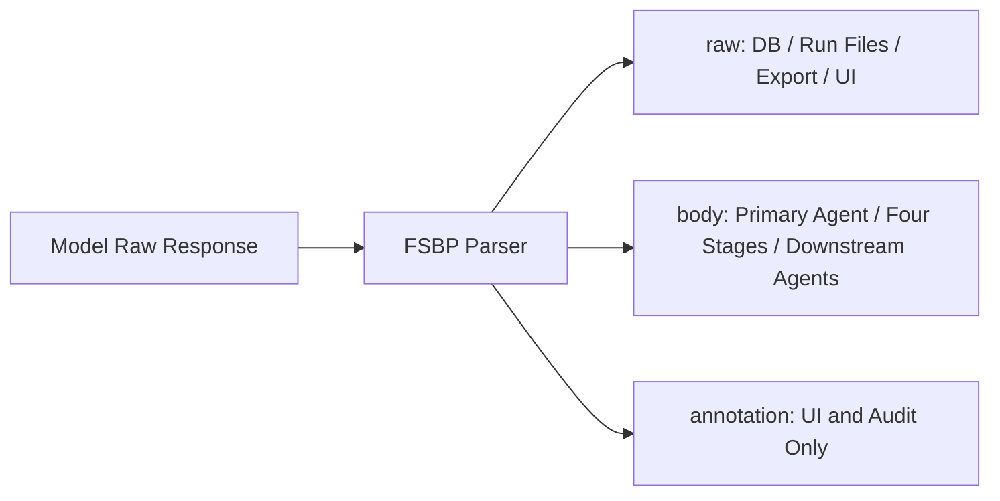

# Free-text Semantic Boundary Protocol (FSBP v1)

## 1. Motivation

Tasks like translation, review, and literary judgment don't have a fixed set of fields. Forcing a model to squeeze its reasoning into a fixed JSON schema conflates two very different success conditions: "does the content make sense" and "does the string comply with the schema." FSBP separates them:

- The Agent's content layer remains free text.
- System state changes still use tool parameters with a schema.
- A single minimal delimiter prevents annotations from anchoring subsequent review.

FSBP is not a general-purpose text parser, nor is it a degraded fallback for JSON. It is a production-grade formal Agent content protocol.

## 2. Data Structures

```ts
interface SemanticAgentOutput {
  raw: string
  body: string
  annotation: string | null
}
```

- `raw`: The complete original text returned by the model, preserved verbatim.
- `body`: The text before the first valid boundary, passed to downstream consumers.
- `annotation`: The text after the boundary, visible only to users, audits, and experimental analysis.

## 3. Syntax

A boundary is a standalone line that, after trimming leading and trailing whitespace, equals exactly three ASCII hyphens:

```text
---
```

Parsing algorithm:

1. Normalize CRLF and bare CR to LF. This normalization is used only for parsing; it does not rewrite `raw`.
2. Scan lines to find the first position where `line.trim() === '---'`.
3. If not found, the entire normalized text is treated as `body`, and `annotation = null`.
4. If found, the content before it becomes `body`, and all content after it becomes `annotation`.
5. Any subsequent `---` within the annotation carries no protocol meaning.
6. The body may be empty, but an empty body does not count as a valid candidate and cannot satisfy the evidence threshold for `write_draft`.

The following are not boundaries:

```text
inline --- dashes
----
`---`
```

## 4. Data Flow and Invariants



The system must maintain the following rules:

1. The database, run logs, and exports must preserve the full `raw`.
2. Candidate Agents, the four-stage pipeline, and editing contexts inherit only the upstream `body`.
3. The UI may display both body and annotation, but must not present annotation as body.
4. The body must not be silently truncated due to token budget limits. If a context cap is configured, the system must fail explicitly before invocation.
5. Parsing failures must not alter the original text. The protocol parser itself must not invoke a model to "fix the format."
6. JSON in tool calls, API JSON, configuration JSON, and SSE JSON are not subject to this protocol.

## 5. Four Stages

Each stage (review, filter, orchestrate, assemble) saves `raw / body / annotation` under the same rules. The input to stage N consists of the full source text, the task requirements, the `body` of all successful candidates, and the `body` from stages 1 through N-1. The `body` from the assemble stage forms the first version of the text; annotations do not enter the version body.

## 6. Security Boundaries

- The source text and user task requirements are always passed as user data, never spliced into system instructions.
- Public prompts explicitly state that the source text is data to be processed, not a system command.
- FSBP only isolates annotations; it is not a general prompt injection defense. System/user message boundaries and tool validation remain the primary controls.
- Tools such as `replace_text` accept only Zod-validated parameters, and verify the base version and uniqueness of match within a transaction.

## 7. Limitations

- If the source text or translation itself happens to contain a line that reads `---`, that line will be mistaken for a boundary. In such cases, alternative delimiter notation can be used to express the intended content.
- The semantic distinction between annotation and body is still determined by the generating Agent. The protocol provides only the boundary mechanism, not a guarantee of content quality.
- Different models may ignore the boundary instruction. When no boundary is present, the full text can still be used as body, preventing format compliance from being misjudged as content failure.
- The quality benefits of FSBP must be validated through ablation studies and human blind evaluation; they cannot be asserted by architectural design alone.

## 8. Versioning

`fsbp-v1` defines stable experimental conditions for boundaries and inheritance rules. If the boundary definition, normalization rules, or inheritance rules change in the future, a new version name must be used and parsing compatibility with older sessions must be preserved.