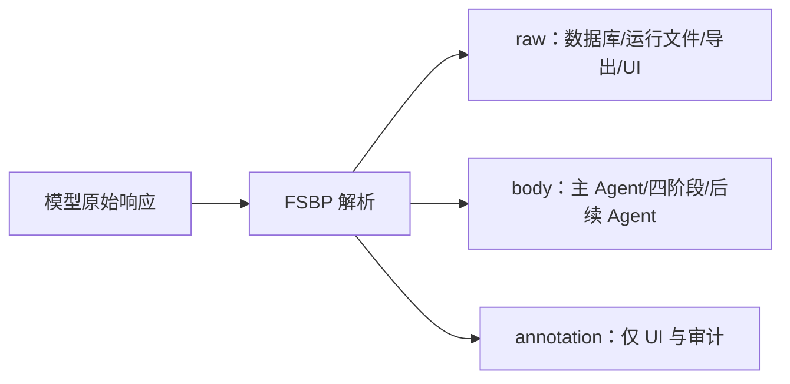

# 自由文本语义边界与审议协议（FSBP v2）

## 1. 动机

翻译、审校和文学判断这类任务，没有固定的字段全集。如果强制模型把思考过程塞进固定 JSON 格式，就会把"内容是否有意义"和"字符串是否符合语法"混为一谈，两种不同的成功条件纠缠在一起。FSBP 把它们拆开：

- Agent 的内容层保持自由文本；
- 系统状态变更仍使用带 schema 的工具参数；
- 一条极简的分隔线就能阻止注释内容锚定后续审校。

FSBP 不是通用的文本解析器，也不是 JSON 的降级替代品。它是产品级的
Agent 语义通信与审议协议。独立成行的 `---` 只是协议最小语法，不能单独代表
完整方法。

## 2. 协议组成

FSBP 由七项相互约束的标准组成：

1. **语义自由生成**：Agent 以自然语言完成开放任务，不为程序解析而把内容强塞
   进固定字段。
2. **正文与解释分离**：边界之前是可继承成果，边界之后是解释、取舍或备注。
3. **选择性继承**：下游只接收正文，避免上游自我辩护直接锚定后续审议。
4. **完整证据留存**：系统永久保存 raw、正文、注释、模型、提示词版本、调用关系
   和错误，不能只保存最终成品。
5. **独立多视角审议**：多个角色围绕同一开放问题产生候选；分歧是比较材料，
   不是需要用 schema 消除的异常。
6. **内容协议与状态协议分层**：翻译、审查和意见使用自由语义协议；调用 Agent、
   修改版本和提交结果仍使用经过校验的结构化工具参数。
7. **显式失败而非静默修剪**：正文不得因格式、上下文预算或解析便利被静默截断、
   改写或丢弃。

因此，FSBP 的核心不变量可以概括为：

> 允许表达自由，但严格约束什么能够被继承、什么必须被留档、什么可以改变系统状态。

## 3. 数据结构

```ts
interface SemanticAgentOutput {
  raw: string
  body: string
  annotation: string | null
}
```

- `raw`：模型返回的完整原始文本，逐字保存。
- `body`：最后一个有效边界之前的内容，供下游使用。
- `annotation`：边界之后的内容，仅供用户查看、审计和实验分析。

## 4. 语法

边界是一条独立行，去掉首尾空白后严格等于三个 ASCII 连字符：

```text
---
```

解析算法：

1. 将 CRLF 和单独的 CR 统一规范为 LF。此规范化仅在解析时使用，不改写 `raw`。
2. 从末尾向前查找第一个满足 `line.trim() === '---'` 的位置，也就是全文最后一个有效边界。
3. 如果没找到，将规范化后的整个文本视为 `body`，`annotation = null`。
4. 如果找到，之前的内容为 `body`，之后的所有内容为 `annotation`。
5. 最后边界之前再次出现的 `---` 属于正文，不具有协议边界含义。
6. 正文可以为空，但空正文不能算作有效候选，也不能满足 `write_draft` 的证据门槛。

以下内容不是边界：

```text
句中 --- 符号
----
`---`
```

## 5. 数据流与不变量



系统必须遵守以下规则：

1. 数据库、运行记录和导出数据必须保存完整的 `raw`。
2. 候选 Agent、四阶段流程和编辑上下文只继承上游的 `body`。
3. UI 可以同时展示正文和注释，但不能把注释伪装成正文。
4. 不得因 token 预算限制而静默截断正文。如果配置了上下文上限，应在调用前明确报错。
5. 解析失败不得改写原文。协议解析本身不调用模型去"修复格式"。
6. 工具调用中的 JSON、API JSON、配置 JSON 和 SSE JSON 不受此协议约束。

## 6. 审议标准

FSBP 不规定唯一的翻译理论，但要求各阶段遵守以下过程标准：

- 候选必须是可独立阅读的完整成果，而非只给建议；
- Agent 的角色只限定观察角度，不限定固定输出字段；
- 下游基于原文、任务要求和候选正文独立判断；
- 解释不能因措辞自信或篇幅更长而自动获得更高权重；
- 评审先核对语义骨架、逻辑、语气和领域概念，再评目标语表达；
- 无法判断的问题显式标记为待核验，不能由格式成功替代内容正确。

这些标准与 `---` 解析规则共同构成 FSBP。改变角色数量不必改变协议版本；
改变继承、留档或边界语义则必须升级协议版本。

## 7. 四阶段

审查、筛选、编排、组装各阶段都按相同规则保存 `raw / body / annotation`。阶段 N 的输入由完整原文、任务要求、全部成功候选的 `body` 以及阶段 1 到 N-1 的 `body` 组成。组装阶段的 `body` 形成第一版文本，annotation 不进入版本正文。

自由文本不等于各阶段可以任意改变正文的用途。为了让 body-only 继承保留真正需要的证据，四阶段采用稳定的正文语义契约：

- `review.body` 保存按影响排序的错误、风险与可取处理，供筛选阶段直接判断；
- `filter.body` 保存候选的保留、淘汰与修补决定，供编排阶段执行；
- `orchestrate.body` 保存一份完整、可继续修改的工作译文；
- `assemble.body` 保存完成原文复核和目标语通读后的正式译文。

过程说明、自我评价和面向用户的补充说明放在最后一个独立 `---` 之后。阶段可以自由组织正文的段落与措辞，但不能把下一阶段必需的核心证据全部移入 annotation。这个语义契约与边界、继承和留档规则共同构成 FSBP。

## 8. 安全边界

- 原文和用户任务要求始终作为用户数据传入，不拼入系统指令。
- 公共提示词明确声明原文是待处理数据，不是系统命令。
- FSBP 只负责隔离注释，不是通用的 prompt injection 防护手段。系统/用户消息层级和工具校验仍然是主要的控制机制。
- `replace_text` 等工具只接受经过 Zod 校验的参数，并在事务中校验基础版本和唯一匹配。

## 9. 可验证主张

FSBP 本身不能靠定义证明有效。可以分别检验：

1. 自由语义输出相对提示词 JSON 或原生 JSON Output 的工程可靠性；
2. body-only 继承相对 raw 继承是否降低上游注释造成的审议锚定；
3. 多视角候选与独立审议是否相对强模型直接翻译改善质量；
4. 完整证据和版本链是否提升错误定位、人工修订效率与可复现性。

四项结果必须分别报告。即使某一项不成立，也不能用其他结果替代。

## 10. 局限

- 如果正文内部包含独立一行的 `---`，该行会保留在正文中；模型需要把真正的注释边界放在回复最后。正文自身以独立 `---` 结尾且没有注释时仍可能产生歧义。
- 注释和正文的语义区分仍由生成 Agent 判断。协议与审议标准不能直接保证内容质量。
- 不同模型可能忽略边界说明。如果没有边界，全文仍可作为正文使用，避免把格式服从误判为内容失败。
- body-only 可以减少一种上下文锚定，但也可能丢失有价值的术语说明；产品保留 raw
  供人类查看，并通过实验评估这一取舍。
- 多 Agent 可能产生同质候选、增加成本或形成虚假共识，需要通过角色差异、模型差异
  和异议视角控制。
- FSBP 的质量收益需要通过消融实验和人工盲评来验证，不能仅凭架构设计自证。

## 11. 版本

`fsbp-v2` 使用最后一个有效边界，让正文内部较早出现的横线继续留在正文。`fsbp-v1` 使用第一个有效边界，已有实验结果应继续标明原版本。未来如果再次改变边界定义、规范化规则或继承规则，必须使用新的版本名。
