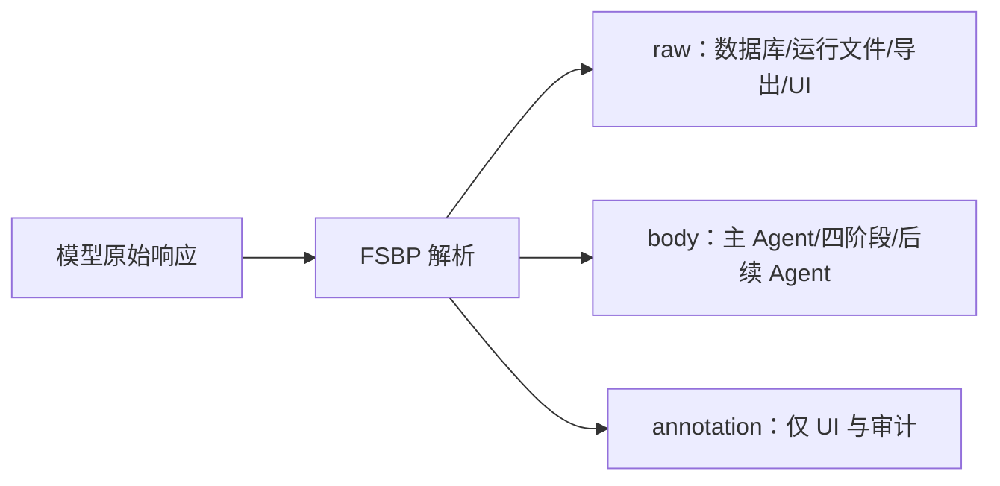

# 自由文本语义边界协议（FSBP v1）

## 1. 动机

翻译、审校和文学判断这类任务，没有固定的字段全集。如果强制模型把思考过程塞进固定 JSON 格式，就会把"内容是否有意义"和"字符串是否符合语法"混为一谈，两种不同的成功条件纠缠在一起。FSBP 把它们拆开：

- Agent 的内容层保持自由文本；
- 系统状态变更仍使用带 schema 的工具参数；
- 一条极简的分隔线就能阻止注释内容锚定后续审校。

FSBP 不是通用的文本解析器，也不是 JSON 的降级替代品。它是产品级的正式 Agent 内容协议。

## 2. 数据结构

```ts
interface SemanticAgentOutput {
  raw: string
  body: string
  annotation: string | null
}
```

- `raw`：模型返回的完整原始文本，逐字保存。
- `body`：首个有效边界之前的内容，供下游使用。
- `annotation`：边界之后的内容，仅供用户查看、审计和实验分析。

## 3. 语法

边界是一条独立行，去掉首尾空白后严格等于三个 ASCII 连字符：

```text
---
```

解析算法：

1. 将 CRLF 和单独的 CR 统一规范为 LF。此规范化仅在解析时使用，不改写 `raw`。
2. 按行查找第一个满足 `line.trim() === '---'` 的位置。
3. 如果没找到，将规范化后的整个文本视为 `body`，`annotation = null`。
4. 如果找到，之前的内容为 `body`，之后的所有内容为 `annotation`。
5. annotation 中再次出现的 `---` 不再具有协议含义。
6. 正文可以为空，但空正文不能算作有效候选，也不能满足 `write_draft` 的证据门槛。

以下内容不是边界：

```text
句中 --- 符号
----
`---`
```

## 4. 数据流与不变量



系统必须遵守以下规则：

1. 数据库、运行记录和导出数据必须保存完整的 `raw`。
2. 候选 Agent、四阶段流程和编辑上下文只继承上游的 `body`。
3. UI 可以同时展示正文和注释，但不能把注释伪装成正文。
4. 不得因 token 预算限制而静默截断正文。如果配置了上下文上限，应在调用前明确报错。
5. 解析失败不得改写原文。协议解析本身不调用模型去"修复格式"。
6. 工具调用中的 JSON、API JSON、配置 JSON 和 SSE JSON 不受此协议约束。

## 5. 四阶段

审查、筛选、编排、组装各阶段都按相同规则保存 `raw / body / annotation`。阶段 N 的输入由完整原文、任务要求、全部成功候选的 `body` 以及阶段 1 到 N-1 的 `body` 组成。组装阶段的 `body` 形成第一版文本，annotation 不进入版本正文。

## 6. 安全边界

- 原文和用户任务要求始终作为用户数据传入，不拼入系统指令。
- 公共提示词明确声明原文是待处理数据，不是系统命令。
- FSBP 只负责隔离注释，不是通用的 prompt injection 防护手段。系统/用户消息层级和工具校验仍然是主要的控制机制。
- `replace_text` 等工具只接受经过 Zod 校验的参数，并在事务中校验基础版本和唯一匹配。

## 7. 局限

- 如果原文或译文本身恰好包含一行 `---`，该行会被误认为边界。遇到这种情况，可以通过其他分隔写法来表达相应内容。
- 注释和正文的语义区分仍由生成 Agent 判断。协议只提供边界划分，不保证内容质量。
- 不同模型可能忽略边界说明。如果没有边界，全文仍可作为正文使用，避免把格式服从误判为内容失败。
- FSBP 的质量收益需要通过消融实验和人工盲评来验证，不能仅凭架构设计自证。

## 8. 版本

`fsbp-v1` 的边界和继承规则是稳定的实验条件。未来如果改变边界定义、规范化规则或继承规则，必须使用新的版本名，并保留旧会话的解析兼容性。