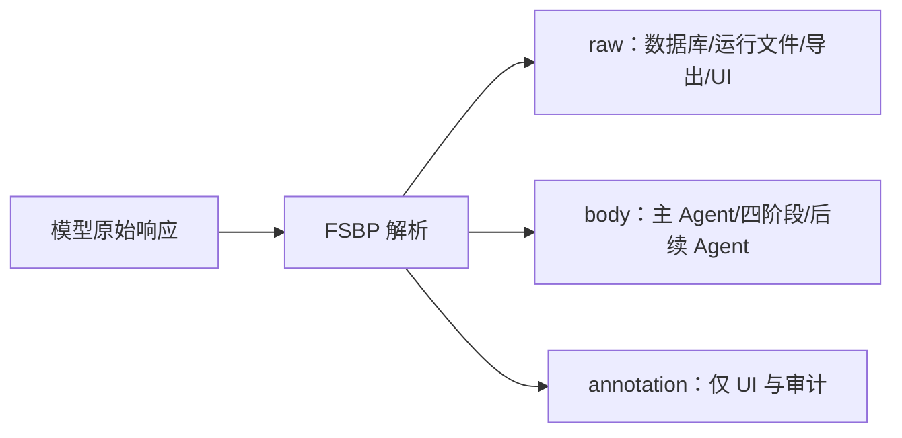

# 自由文本语义边界协议（FSBP v1）

## 1. 动机

翻译、审议和文学判断没有稳定的字段全集。强制模型把思考压入固定 JSON，会把“内容是否有意义”和“字符串是否符合语法”混成同一类成功条件。FSBP 将两者分开：

- Agent 内容层保持自由文本；
- 系统状态变更仍使用有 schema 的工具参数；
- 一个极小边界足以阻断注释对后续审议的锚定。

FSBP 不是任意文本解析器，也不是对 JSON 的降级兼容；它是产品的正式 Agent 内容协议。

## 2. 数据结构

```ts
interface SemanticAgentOutput {
  raw: string
  body: string
  annotation: string | null
}
```

- `raw`：模型返回的完整原始文本，逐字持久化。
- `body`：首个有效边界之前的文本，提供给下游。
- `annotation`：边界之后的文本，仅供用户、审计与实验查看。

## 3. 语法

边界是去除行首尾空白后严格等于三个 ASCII 连字符的独立行：

```text
---
```

解析算法：

1. 将 CRLF 和单独 CR 规范为 LF，仅用于解析视图，不改写 `raw`。
2. 按行查找第一个 `line.trim() === '---'` 的位置。
3. 未找到时，规范化文本整体为 `body`，`annotation = null`。
4. 找到时，之前内容为 `body`，之后全部内容为 `annotation`。
5. annotation 中后续出现的 `---` 不再具有协议含义。
6. 正文允许为空，但空正文不能算成功候选，也不能满足 `write_draft` 的证据门槛。

以下内容不是边界：

```text
句中 --- 符号
----
`---`
```

## 4. 数据流与不变量



系统必须保持：

1. DB、运行记录和导出保存完整 `raw`。
2. 候选 Agent、四阶段和编辑上下文只继承上游 `body`。
3. UI 可以同时查看正文和注释，不能把注释伪装成正文。
4. 不因 token 预算静默删减正文；配置了上下文上限时调用前显式失败。
5. 解析失败不得改写原文；协议解析本身不调用模型“修复格式”。
6. 工具调用 JSON、API JSON、配置 JSON 与 SSE JSON 不受此协议约束。

## 5. 四阶段

审查、筛选、编排、组装均按相同规则保存 `raw/body/annotation`。阶段 N 的输入由完整原文、任务要求、全部成功候选 `body` 与阶段 1…N-1 的 `body` 组成。组装阶段的 `body` 建立第一版文本；annotation 不进入版本正文。

## 6. 安全边界

- 原文和用户任务要求始终作为用户数据传入，不拼入系统指令。
- 公共提示词明确说明原文是待处理数据，不是系统命令。
- FSBP 只隔离注释，不是通用 prompt injection 防护；系统/用户消息层级和工具校验仍是主要控制。
- `replace_text` 等工具只接受 Zod 校验后的参数，并在事务中校验基础版本和唯一匹配。

## 7. 局限

- 原文或译文本身若需要一行 `---`，该行会被视为边界。任务可通过其他分隔写法表达该内容。
- 注释与正文的语义判断仍由生成 Agent 决定；协议只提供边界，不证明内容质量。
- 不同模型可能忽略边界说明。无边界时全文仍可作为正文，避免把格式服从误判为内容失败。
- FSBP 的质量收益需要通过协议消融与人工盲评验证，不能由架构设计本身推出。

## 8. 版本

`fsbp-v1` 的边界和继承规则是稳定实验条件。未来若改变边界、规范化或继承规则，必须使用新版本名并保留旧会话解析兼容。
